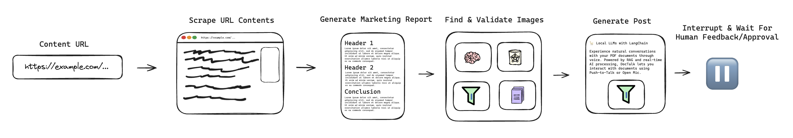
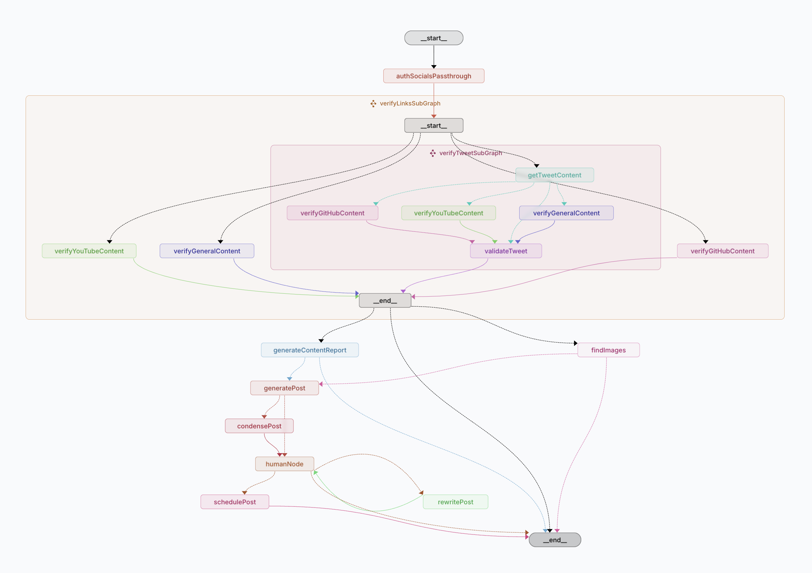

# Social Media Agent

This repository contains an 'agent' which can take in a URL, and generate a Twitter & LinkedIn post based on the content of the URL. It uses a human-in-the-loop (HITL) flow to handle authentication with different social media platforms, and to allow the user to make changes, or accept/reject the generated post.



## Table of contents

- [Quickstart](#quickstart)
  - [Environment variables](#set-environment-variables)
  - [LangGraph Server](#set-environment-variables)
- [Full setup](#advanced-setup)
  - [Environment variables](#set-environment-variables-1)
  - [LangGraph Server](#install-langgraph-cli-1)
  - [Twitter Auth](#twitter-developer-setup-instructions)
  - [Arcade Auth](#arcade-setup-instructions)
  - [LinkedIn Auth](#setup-linkedin-authentication)
  - [Supabase](#setup-supabase)
  - [Slack](#setup-slack)
  - [GitHub](#setup-github)
- [Usage](#usage)
  - [Generate Demo Post](#generate-demo-post)
  - [Setup Crons](#setup-crons)
  - [Prebuilt Scripts](#prebuilt-scripts)
- [Setup Agent Inbox](#setup-agent-inbox)
  - [Using the deployed inbox](#using-the-deployed-inbox)
  - [Using the local inbox](#using-the-local-inbox)
- [Customization](#customization)
  - [Prompts](#prompts)
  - [Post Style](#post-style)

# Quickstart

> [!NOTE]
> 🎥 For a visual guide, check out our [step-by-step video tutorial](https://youtu.be/TmTl5FMgkCQ) that walks you through the account setup process and project configuration.

This quickstart covers how to setup the Social Media Agent in a basic setup mode. This is the quickest way to get up and running, however it will lack some of the features of the full setup mode. See [here](#advanced-setup) for the full setup guide.

<details>
<summary>Running in basic setup mode will lack the following features:</summary>

- Parsing content from GitHub, Twitter or YouTube URLs
- Ingesting data from Slack, or sending updates to Slack
- Image selection & uploads

</details>

To get started, you'll need the following API keys/software:

- [Anthropic API](https://console.anthropic.com/) - General LLM
- [LangSmith](https://smith.langchain.com/) - LangSmith API key required to run the LangGraph server locally (free)
- [FireCrawl API](https://www.firecrawl.dev/) - Web scraping. New users get 500 credits for free
- [Arcade](https://www.arcade-ai.com/) - Social media authentication for reading & writing

## Setup Instructions

### Clone the repository:

```bash
git clone https://github.com/langchain-ai/social-media-agent.git
```

```bash
cd social-media-agent
```

### Install dependencies:

```bash
yarn install
```

### Set environment variables.

Copy the values of the quickstart `.env.quickstart.example` to `.env`, then add the values:

```bash
cp .env.quickstart.example .env
```

Once done, ensure you have the following environment variables set:

```bash
# For LangSmith tracing (optional)
LANGCHAIN_API_KEY=
LANGCHAIN_TRACING_V2=true

# For LLM generations
ANTHROPIC_API_KEY=

# For web scraping
FIRECRAWL_API_KEY=

# Arcade API key - used for fetching Tweets, and scheduling LinkedIn/Twitter posts
ARCADE_API_KEY=
```

### Install LangGraph CLI

```bash
pip install langgraph-cli
```

Then run the following command to check the CLI is installed:

```bash
langgraph --version
```

Click [here](https://langchain-ai.github.io/langgraph/cloud/reference/cli/) to read the full download instructions for the LangGraph CLI.

### Start the LangGraph server:

First, make sure you have Docker installed and running. You can check this by running the following command:

```bash
docker ps
```

Then, run the following command to start the LangGraph server: (ensure you either have the `LANGGRAPH_API_KEY` exposed in your path, or include it inline when you run the command)

```bash
yarn langgraph:up
```

or

```bash
LANGCHAIN_API_KEY="lsv2_pt_..." yarn langgraph:up
```

The first time you run this command, it will take a few minutes to start up. Once it's ready, you can execute the following command to generate a demo post:

```bash
yarn generate_post
```

This will kick off a new run to generate a post on a [LangChain blog post](https://blog.langchain.dev/customers-appfolio/).

To view the output, either inspect it in LangSmith, or use Agent Inbox.

> [!NOTE]
> Follow these steps to setup & configure the Agent Inbox: [Setup Agent Inbox Guide](#setup-agent-inbox)

# Advanced Setup



To use all of the features of the Social Media Agent, you'll need the following:

- [Anthropic API](https://console.anthropic.com/) - General LLM
- [Google Vertex AI](https://cloud.google.com/vertex-ai) - For dealing with YouTube video content
- [LangSmith](https://smith.langchain.com/) - LangSmith API key required to run the LangGraph server locally (free)
- [FireCrawl API](https://www.firecrawl.dev/) - Web scraping
- [Arcade](https://www.arcade-ai.com/) - Social media authentication
- [Twitter Developer Account](https://developer.twitter.com/en/portal/dashboard) - For uploading media to Twitter
- [LinkedIn Developer Account](https://developer.linkedin.com/) - Posting to LinkedIn
- [GitHub API](https://github.com/settings/personal-access-tokens) - Reading GitHub content
- [Supabase](https://supabase.com/) - Storing images
- [Slack Developer Account](https://api.slack.com/apps) (optional) - ingesting data from a Slack channel

## Setup Instructions

### Clone the repository:

```bash
git clone https://github.com/langchain-ai/social-media-agent.git
```

```bash
cd social-media-agent
```

### Install dependencies:

```bash
yarn install
```

### Set environment variables.

Copy the values of the full env example file `.env.full.example` to `.env`, then update the values as needed.

```bash
cp .env.full.example .env
```

### Install LangGraph CLI

```bash
pip install langgraph-cli
```

Then run the following command to check the CLI is installed:

```bash
langgraph --version
```

Click [here](https://langchain-ai.github.io/langgraph/cloud/reference/cli/) to read the full download instructions for the LangGraph CLI.

### Setup Twitter

Setting up Twitter requires a Twitter developer account for uploading media to Twitter, and an Arcade account if you plan on using it for posting to Twitter. This however is optional, as you can use your own Twitter developer account for all reading & writing.

### Arcade Setup Instructions

Create an Arcade account [here](https://www.arcade-ai.com/). Once done, setting up the account, ensure you have an Arcade API key. Set this value as `ARCADE_API_KEY` in your `.env` file.

Make sure you have the `USE_ARCADE_AUTH` environment variable set to `true` to have the graph use Arcade authentication.

### Twitter Developer Setup Instructions

You'll need to follow these instructions if you plan on uploading media to Twitter, and/or want to use your own Twitter developer account for all reading & writing.

- Create a Twitter developer account
- Create a new app and give it a name.
- Copy the `API Key`, `API Key Secret` and `Bearer Token` and set them as `TWITTER_API_KEY`, `TWITTER_API_KEY_SECRET`, and `TWITTER_BEARER_TOKEN` in your `.env` file.
- After saving, visit the App Dashboard. Find the `User authentication settings` section, and click the `Set up` button. This is how you will authorize users to use the Twitter API on their behalf.
- Set the following fields:
  - `App permissions`: `Read and write`
  - `Type of App`: `Web App, Automated App or Bot`
  - `App info`:
    - `Callback URI/Redirect URL`: `http://localhost:3000/auth/twitter/callback`
    - `Website URL`: Your website URL
- Save. You'll then be given a `Client ID` and `Client Secret`. Set these as `TWITTER_CLIENT_ID` and `TWITTER_CLIENT_SECRET` in your `.env` file.

Once done, run the `yarn start:auth` command to run the Twitter OAuth server. Open [http://localhost:3000](http://localhost:3000) in your browser, and click `Login with Twitter`.

After authorizing your account with the app, navigate to your terminal where you'll see a JSON object logged. Copy the `token` and `tokenSecret` values and set them as `TWITTER_USER_TOKEN` and `TWITTER_USER_TOKEN_SECRET` in your `.env` file.

After setting up Twitter/Arcade, set the `TWITTER_USER_ID` environment variable to the user ID of the account that you want to use to post to Twitter. (e.g `TWITTER_USER_ID="LangChainAI"`)

### Setup LinkedIn authentication:

To authorize posting on LinkedIn, you'll need to:

1. Create a new LinkedIn developer account, and app [here](https://developer.linkedin.com/)
2. After creating your app, navigate to the `Auth` tab, and add a new authorized redirect URL for OAuth 2.0. Set it to `http://localhost:3000/auth/linkedin/callback`
3. Go to the `Products` tab and enable the `Share on LinkedIn` and `Sign In with LinkedIn using OpenID Connect` products.

<details>
<summary>If you plan on posting from company pages, you'll need to do the following:</summary>

1. If you plan on posting from company pages, you'll also need to enable the `Advertising API` product. Furthermore, ensure your personal account has at least one one of the following roles with the company page:

- `ADMINISTRATOR`
- `DIRECT_SPONSORED_CONTENT_POSTER`
- `RECRUITING_POSTER`

2. Next, ensure your company page has verified the app. You can create a verification link on the `Settings` tab of your app, then click the `Verify` button on the company page card.
3. Once requesting access, you'll need to fill out a form for verification. Once submitted, you should receive an email stating you've been granted developer access which will give you the proper permission to test out the API until it's been approved.
4. Inside the [authorization server file (./src/clients/auth-server.ts)](./src/clients/auth-server.ts), ensure the `w_organization_social` scope is enabled inside the scopes string in the `/auth/linkedin` route. Once done, the scopes string should look like this: `openid profile email w_member_social w_organization_social`
5. Get the organization ID from the URL of the company page when you're logged in as an admin and set it as the `LINKEDIN_ORGANIZATION_ID` environment variable. For example, if the URL is `https://www.linkedin.com/company/12345678/admin/dashboard/`, the organization ID would be `12345678`.

> NOTE
>
> If you plan on only posting from the company account, you can set the `POST_TO_LINKEDIN_ORGANIZATION` to `"true"` in your `.env` file. If you want to choose dynamically, you can set this to `true`/`false` in the configurable fields (`postToLinkedInOrganization`) when invoking the `generate_post` graph.
>
> This value will take precedence over the `POST_TO_LINKEDIN_ORGANIZATION` environment variable.

</details>

4. Save the following environment variables in your `.env` file:

- `LINKEDIN_CLIENT_ID`
- `LINKEDIN_CLIENT_SECRET`

5. Run the `yarn start:auth` command to run the LinkedIn OAuth server. Open [http://localhost:3000](http://localhost:3000) in your browser, and click `Login with LinkedIn`.
6. After logging in, copy the `access_token` and `sub` values from the objects logged to the terminal. Set these values as `LINKEDIN_ACCESS_TOKEN` (`access_token`) and `LINKEDIN_PERSON_URN` (`sub`) in your `.env` file.

</details>

After setting up LinkedIn, set the `LINKEDIN_USER_ID` environment variable to the user ID of the account that you want to use to post to LinkedIn. (e.g `LINKEDIN_USER_ID="your_linkedin_email_address@example.com"`)

### Setup Supabase

Supabase is required for storing images found/generated by the agent. This step is not required for running the agent in basic setup mode.

To setup Supabase, create an account and a new project.

Set the `SUPABASE_URL` and `SUPABASE_SERVICE_ROLE_KEY` environment variables to the values provided by Supabase.

Create a new storage bucket called `images`. Make sure the bucket is set to public to the image URLs are accessible. Also ensure the max upload size is set to at least 5MB inside the global project settings, and the bucket specific settings.

### Setup Slack

Slack integration is optional, but recommended if you intend on using the `ingest_data` agent, or having updates sent to Slack.

This agent can be used in a cron job to fetch messages from a Slack channel, and call the `generate_post` graph for each message. We use this flow internally at LangChain to enable having a single Slack channel for submitting relevant URLs to the agent, which are then turned into posts once daily.

To configure the Slack integration, create a new Slack app and install it into your desired Slack workspace.

Once installed, ensure it has access to the channel you want to ingest messages from. Additionally, if you want it to send update messages to Slack, it will need write permissions to the workspace.

Finally, make sure the `SLACK_BOT_TOKEN` environment variable is set in your `.env` file. Then, when you create a cron (see the [Setup Crons](#setup-crons) section), you'll only have to pass in the channel ID to ingest messages from.

To enable sending updates to Slack, add a `SLACK_CHANNEL_ID` environment variable to your `.env` file with the channel ID you want to send updates to (at LangChain, we have one channel for sending content links, and a separate one for sending update messages).

### Setup GitHub

The GitHub API token is required to fetch details about GitHub repository URLs submitted to the agent. This is not required if you do not plan on sending GitHub URLs to the agent.

To get a GitHub API token, create a new fine grained token with the `Public Repositories (read-only)` scope at a minimum. If you intend on using this agent for private GitHub repositories, you'll need to give the token access to those repositories as well.

Ensure this is set as `GITHUB_TOKEN` in your `.env` file.

# Usage

## Generate Demo Post

Once this is done, start your graph server by running: (ensure you either have the `LANGGRAPH_API_KEY` exposed in your path, or include it inline when you run the command)

```bash
yarn langgraph:up
```

or

```bash
LANGCHAIN_API_KEY="lsv2_pt_..." yarn langgraph:up
```

The first time you run this command, it will take a few minutes to start up. Once it's ready, you can execute the following command to generate a demo post:

After the graph is ready, you can run the following command to generate a demo post:
(before doing this, you should edit the file so that the text only mode is set to false: `[TEXT_ONLY_MODE]: false`)

```bash
yarn generate_post
```

This will kick off a new run to generate a post on a [LangChain blog post](https://blog.langchain.dev/customers-appfolio/).

To view the output, either inspect it in LangSmith, or use [the Agent Inbox](#setup-agent-inbox).

## Setup Crons

The Agent Inbox is most powerful when used with cron jobs. Doing this allows you to send links to generate posts on to a Slack channel, and have the cron job check for these links asynchronously. With this setup, you can send links to Slack, and have the inbox handle the rest while you sleep.

We have a series of scripts to help with this, which you can find in the [`scripts/crons`](./scripts/crons) directory. In this section, we'll explain how to quickly create a cron for ingesting links to your graph from Slack.

### Slack Setup

Before we get started, ensure you have the proper Slack integration setup, as described in the [Setup Slack](#setup-slack) section. Then, edit the [`create-cron.ts`](./scripts/crons/create-cron.ts) file, and set the `slackChannelId` field to the channel ID of the channel you want to ingest links from.

After editing, run the following command to create the cron:

```bash
yarn cron:create
```

This will create a new cron job that will ingest links from Slack into your graph, once daily.

## Prebuilt Scripts

For more information on all of the prebuilt scripts, see the [`scripts/README.md`](./scripts/README.md) file.

# Setup Agent Inbox

The Agent Inbox is the easiest way to view interrupted events, and manage accepting, responding, or other allowed actions. To view your events in the inbox, you can either add your graph to the deployed version of the Agent Inbox, or clone & run the Agent Inbox locally.

## Using the deployed inbox

The Agent Inbox is setup in a way that allows for any graph --local or deployed-- to be added & accessed via the UI.

To add your local graph to the inbox, visit the deployed site here: [dev.agentinbox.ai](https://dev.agentinbox.ai/).

If it's your first time vising the site, you'll immediately be prompted to add a new graph. Fill out the form with the following values:

- Graph ID: `generate_post`
- Graph API URL: `http://localhost:54367`
- Name: (optional) `Generate Post (local)`

After saving, you should be able to view your graph in the inbox. If you do this after invoking your graph (and waiting for the thread to interrupt), it will automatically fetch the interrupted event.

## Using the local inbox

To run the Agent Inbox locally, follow the setup instructions [here](https://github.com/langchain-ai/agent-inbox/blob/main/README.md).

Once the web server is running, open your browser and visit [http://localhost:3000](http://localhost:3000). This will then prompt you to add your graph to the inbox.

Fill out the form with the following values:

- Graph ID: `generate_post`
- Graph API URL: `http://localhost:54367`
- Name: (optional) `Generate Post (local)`

## Using the Agent Inbox with a graph deployed on LangGraph Platform

The Agent Inbox can also be used with graph's deployed in production on LangGraph Platform. To use these graphs, the setup steps are the exact same, with the only difference being the graph API URL should be the URL of the deployed graph, and you're required to set a LangSmith API key. This is required to fetch & invoke the deployed graph. LangSmith API keys are stored in your browser's local storage, and never stored on the server.

# Customization

## Prompts

This agent is setup to generate posts for LangChain, using LangChain products as context. To use the agent for your own use case, you should update the following prompts/prompt sections inside the [`prompts`](./src/agents/generate-post/prompts/index.ts) folder:

- `BUSINESS_CONTEXT` - Context to be used when checking whether or not content is relevant to your business/use case.
- `TWEET_EXAMPLES` ([`prompts/examples.ts`](./src/agents/generate-post/prompts/examples.ts)) - A list of examples of posts you'd like the agent to use as a guide when generating the final post.
- `POST_STRUCTURE_INSTRUCTIONS` - A set of structure instructions for the agent to follow when generating the final post.
- `POST_CONTENT_RULES` - A set of general writing style/content guidelines for the agent to follow when generating a post.

The prompt for the marketing report is located in the [`generate-post/nodes/generate-report/prompts.ts`](./src/agents/generate-post/nodes/generate-report/prompts.ts) file. You likely don't need to update this, as it's already structured to be general.

## Post Style

There are two main prompts to modify to change the style of the posts.

1. Post structure instructions (`POST_STRUCTURE_INSTRUCTIONS`). These are the instructions the LLM will follow for how to structure the post generations. This should _not_ be where you specify tone, or writing style. This prompt is used to set the structure each post should follow. By default, it's prompted to include three parts: `Header`, `Body`, `Call to action`. When experimenting with this prompt this, try removing it completely, instead relying on the few-shot examples (`TWEET_EXAMPLES`) and the content rules (`POST_CONTENT_RULES`).
2. Few-shot examples (`TWEET_EXAMPLES`). These are the examples given to the LLM of which it's prompted to use as examples for style, content, tone and structure. This is arguably one of the most important parts of the prompt. Currently, these are set to a handful of Tweets by popular AI focused Twitter accounts. You should _definitely_ update these if you want to generate non-AI focused Tweets, instead with examples of Tweets/posts on your target content.
3. "Business context" (`BUSINESS_CONTEXT`). This prompt is used widely throughout the agent to provide context into your main goal of the social media agent. For us at LangChain, this prompt is used to describe the different LangChain products and services. The default prompt is focused on AI content, but should be updated/edited to match your use case. This prompt is used in verifying content is relevant for you, generating marketing reports, and generating tweets.
